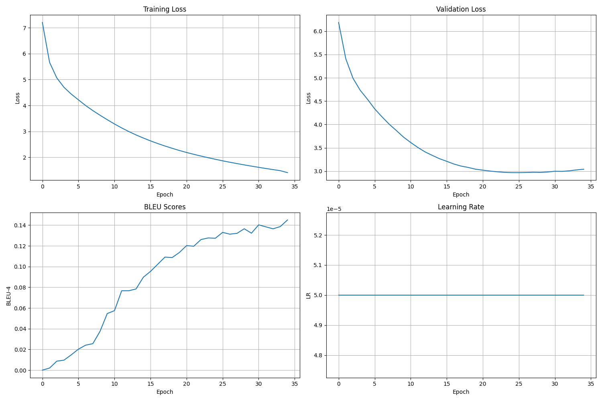

# Transformer NMT Translation - Eng to Chi

[](https://www.python.org/downloads/)
[](https://pytorch.org/)
[](LICENSE)

A Transformer-based Neural Machine Translation project for translating from English to Chinese.

## 🎯 Project Overview

This project provides a complete implementation of the Transformer model for Neural Machine Translation (NMT), based on the paper "Attention Is All You Need". It is built from scratch using PyTorch and is designed to translate sentences from English to Chinese. The project covers all the steps from data preprocessing and vocabulary creation to model training, evaluation, and inference.

### Key Features
- **Transformer Model**: A from-scratch implementation of the encoder-decoder architecture of the Transformer model.
- **Data Preprocessing**: Scripts to process raw text data into a format suitable for training.
- **Training & Evaluation**: A complete pipeline for training the model and evaluating it using the BLEU score.
- **Inference**: A demonstration script to translate new sentences.

## 🚀 Quick Start

### Requirements
- Python 3.8+
- PyTorch
- GPU (recommended for training)

### Installation

1. **Clone the repository:**
    ```bash
    git clone https://github.com/your-username/Transformer-NMT-Translation.git
    cd Transformer-NMT-Translation
    ```

2. **Install dependencies:**
    It is recommended to use a virtual environment.
    ```bash
    pip install -r requirements.txt
    ```
    
3. **Download the dataset:**
    Download and extract the dataset into the `data/raw` directory. The dataset can be found here: [NiuTrans.SMT Sample Data](https://github.com/NiuTrans/NiuTrans.SMT/tree/master/sample-data).

### Usage

#### Data Preprocessing
```bash
python -m src.dataset
```

#### Train the model
```bash
python train.py
```

#### Run the demo
```bash
python demo.py
```

#### Evaluate the model
```bash
python evaluation.py
```

## 📋 Script Parameters

### Data Preprocessing Script (`src/dataset.py`)

The data preprocessing script handles vocabulary creation and dataset preparation:

```bash
python -m src.dataset
```

**Note:** This script doesn't take command-line parameters. It automatically:
- Loads parallel data from `data/raw/train.en` and `data/raw/train.zh`
- Creates source and target vocabularies
- Splits data into training (95%) and validation (5%) sets
- Saves vocabularies to `checkpoints/` directory

**Expected Data Format:**
- `data/raw/train.en`: English sentences (one per line)
- `data/raw/train.zh`: Chinese sentences (one per line)

### Training Script (`train.py`)

The training script supports distributed training and various configuration options:

```bash
python train.py [OPTIONS]
```

**Parameters:**
- `--local_rank` (int, default: 0): Local rank for distributed training. Do not set manually.
- `--distributed` (flag): Enable distributed training. Set by launch script.

**Example Usage:**
```bash
# Single GPU training
python train.py

# Multi-GPU distributed training
python -m torch.distributed.launch --nproc_per_node=4 train.py --distributed
```

### Inference Script (`demo.py`)

The inference script provides multiple modes for translation:

```bash
python demo.py [OPTIONS]
```

**Parameters:**
- `--model_path` (str, default: 'checkpoints/checkpoint_best.pth'): Path to the trained model checkpoint
- `--device` (str, default: 'auto', choices: ['cpu', 'cuda', 'auto']): Device to use for inference
- `--input_text` (str, default: None): A single sentence to translate
- `--input_file` (str, default: None): Path to a text file with sentences to translate (one per line)
- `--output_file` (str, default: 'translations.txt'): Path to save the translations
- `--reference_file` (str, default: None): Path to the reference translations for evaluation
- `--interactive` (flag): Run in interactive mode

**Example Usage:**
```bash
# Interactive translation mode
python demo.py --interactive

# Translate a single sentence
python demo.py --input_text "Hello, how are you?"

# Translate sentences from a file
python demo.py --input_file test_sentences.txt --output_file translations.txt

# Translate with evaluation against reference
python demo.py --input_file test_sentences.txt --reference_file reference.txt

# Use specific model and device
python demo.py --model_path checkpoints/checkpoint_last.pth --device cuda
```

### Evaluation Script (`evaluation.py`)

The evaluation script is primarily used as a module but can also be run standalone for testing:

```bash
python evaluation.py
```

**Note:** The evaluation script doesn't take command-line parameters when run standalone. It's designed to be imported and used programmatically.

## 📁 Project Structure
```
Transformer-NMT-Translation/
├── src/
│   ├── __init__.py
│   ├── model.py          # Model definition (Transformer)
│   └── dataset.py        # Data preprocessing and loading
├── assets/
│   └── training_metrics.png
├── data/
│   ├── raw/              # Raw data
│   └── processed/        # Processed data
├── checkpoints/          # Model checkpoints
├── logs/                 # Log files
├── config.py             # Configuration file
├── train.py              # Training script
├── demo.py               # Inference/demo script
├── evaluation.py         # Evaluation script
├── requirements.txt      # Dependencies
└── README.md             # This README file
```

## 📈 Experimental Results

The model was trained for 35 epochs. The training and validation loss decreased steadily, while the BLEU-4 score on the validation set increased, indicating that the model was learning effectively.

### Training Curves


## 🔧 Configuration

Key hyperparameters and settings can be adjusted in `config.py`.

### Configuration Parameters

```python
# Paths
DATA_DIR = 'data/raw'           # Directory containing raw training data
CHECKPOINT_DIR = 'checkpoints'  # Directory to save model checkpoints
LOGS_DIR = 'logs'              # Directory to save training logs

# Model Parameters
D_MODEL = 512                  # Dimension of model embeddings
NHEAD = 8                      # Number of attention heads
NUM_ENCODER_LAYERS = 6         # Number of encoder layers
NUM_DECODER_LAYERS = 6         # Number of decoder layers
DIM_FEEDFORWARD = 2048         # Dimension of feedforward network
DROPOUT = 0.1                  # Dropout rate
MAX_LEN = 128                  # Maximum sequence length

# Training Parameters
NUM_EPOCHS = 35                # Number of training epochs
BATCH_SIZE = 64                # Training batch size
LEARNING_RATE = 5e-5           # Learning rate
CLIP_GRAD = 1.0                # Gradient clipping value
LOG_INTERVAL = 100             # Logging interval (steps)

# Distributed Training
DISTRIBUTED = False            # Enable distributed training
LOCAL_RANK = 0                 # Local rank for distributed training

# Other
NUM_WORKERS = 4                # Number of data loading workers
```

### Model Architecture

The Transformer model follows the original "Attention Is All You Need" paper:

- **Encoder**: 6 layers with multi-head self-attention
- **Decoder**: 6 layers with masked multi-head self-attention and cross-attention
- **Embedding Dimension**: 512
- **Attention Heads**: 8
- **Feedforward Dimension**: 2048
- **Dropout**: 0.1

### Training Strategy

- **Optimizer**: Adam with β₁=0.9, β₂=0.98, ε=1e-9
- **Learning Rate**: 5e-5 with ReduceLROnPlateau scheduler
- **Gradient Clipping**: 1.0
- **Batch Size**: 64 (adjustable for distributed training)
- **Validation**: Every epoch with BLEU-4 scoring

## 📊 Dataset Information

### NiuTrans.SMT Sample Data
This project uses sample data from the NiuTrans project. It contains parallel corpora for English-Chinese translation.

- **Download URL**: [NiuTrans.SMT Sample Data](https://github.com/NiuTrans/NiuTrans.SMT/tree/master/sample-data) 
- **Data Location**: Please place the downloaded dataset in the `data/raw` directory.

## 🤝 Contribution Guidelines

Contributions are welcome! If you have suggestions for improvement, please feel free to submit an issue or pull request.

1. Fork this repository
2. Create your feature branch (`git checkout -b feature/AmazingFeature`)
3. Commit your changes (`git commit -m 'Add some AmazingFeature'`)
4. Push to the branch (`git push origin feature/AmazingFeature`)
5. Open a Pull Request

## 📄 License

This project is licensed under the MIT License.

## 🙏 Acknowledgements

- The seminal paper: [Attention Is All You Need](https://arxiv.org/abs/1706.03762)
- The PyTorch team for the powerful deep learning framework.
- The NiuTrans team for providing the sample dataset.

---

**Note**: This implementation is for educational and research purposes only. 